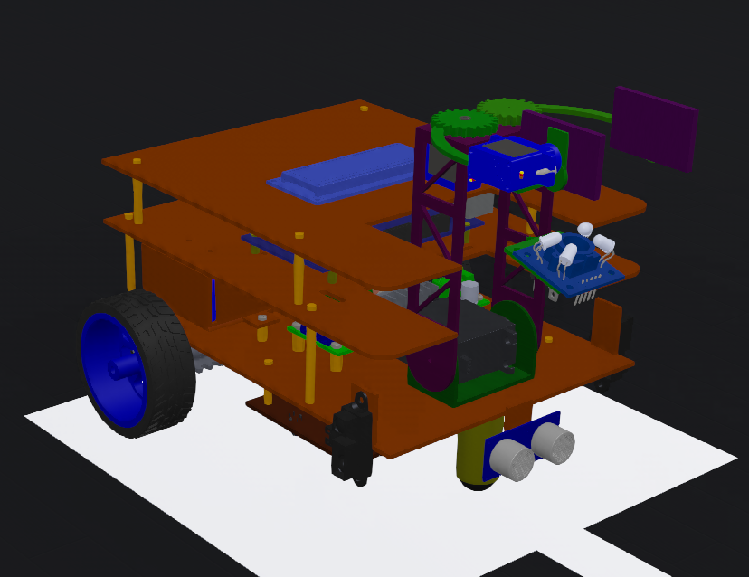
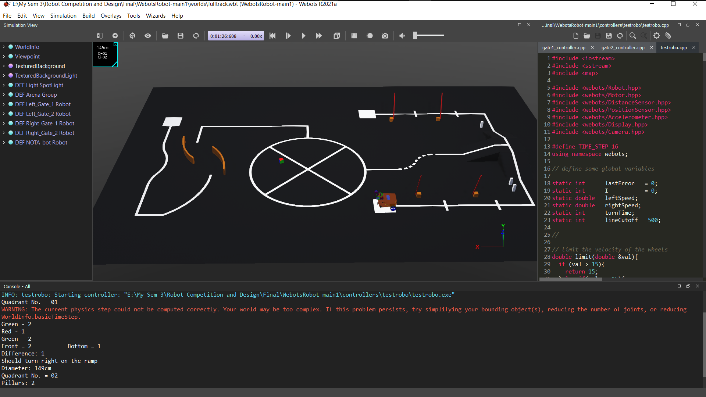
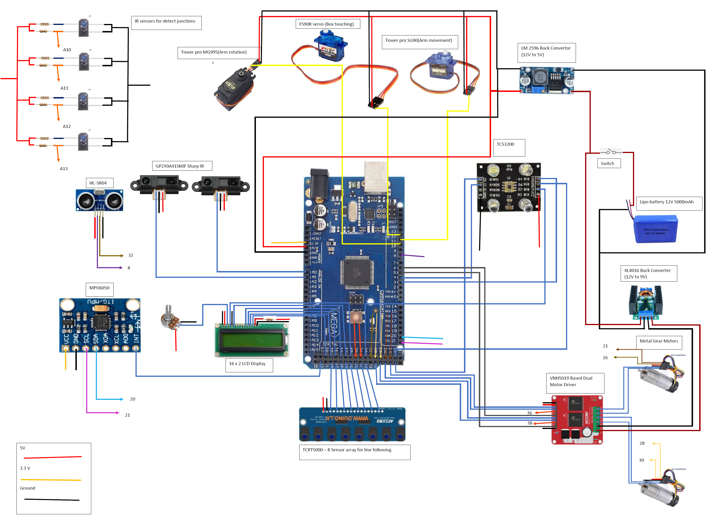

# Webots Autonomous Mobile Robot

 
 
## Introduction

This repository includes all the project files related to the development of an Autonomous mobile robot using the [WEBOTS simulation platform](https://cyberbotics.com/).  The given [tutorials](https://cyberbotics.com/doc/guide/tutorials) can be useful for beginners.

## Final Simulation Test Results

## Wiring Diagram of the Robot

## Team

The project is being done by a team of 5 undergraduates at the Department of Electronic and Telecommunication Engineering, University of Moratuwa, Sri Lanka. Details of the team members can be found below.

#### Team Leader

[Laksara Thilakarathna](https://github.com/LaksaraThilakarathna)

#### Group Members
1. [Muhammad Aqeel](https://github.com/AqeelMuhammad)
1. [Tharuka Nilupul](https://github.com/TharukaN17)
1. [Tharindu Wijesinghe](https://github.com/Tharindu531)
1. [Navoda Sewwandi](https://github.com/Navoda-Sewwandi)
